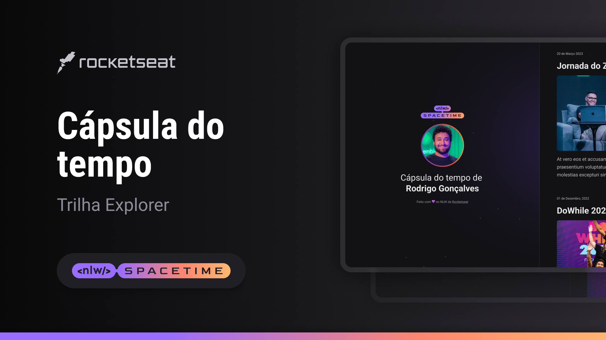

 

## Projeto 🖥️

Este é um projeto Web Responsivo, desenvolvido durante a maratona da NLW - Spacetime (Explorer), que consiste em ser uma cápsula do tempo para exibir as memórias em uma timeline "Linha do Tempo"

## Tecnologias 🚀

Esse projeto foi desenvolvido com as seguintes tecnologias

- HTML
- CSS
- GIT e GitHub

## Layout 🗺️

Você pode visualizar o layout do projeto através do
[link](https://www.figma.com/community/file/1240071097028170811)
